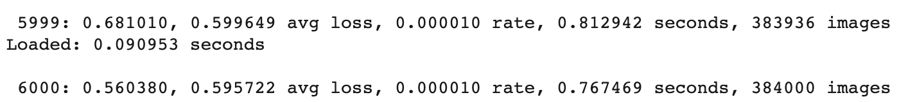
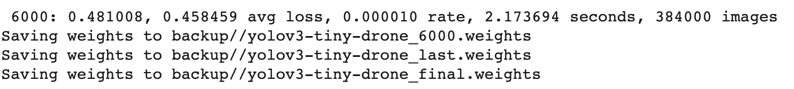
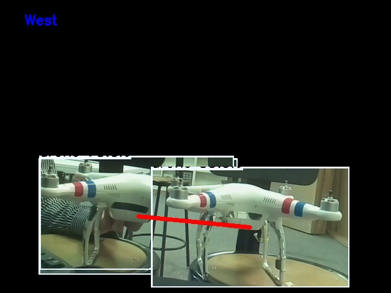

# **Inbae Kang**

## 1.Structure
**ROS in GUAVA**
  - There are four packages in GUAVA(Grab UAV Accurately) project.
    - main : Package that give orders to other packages and Receive Result from each packages.
    - radar : Package that get raw data using radar, make SAR image and classify object.
    - camera : Package that take a picture and classify object.
    - rail : Package that control movement of rail needed for making SAR image.
  - And each package consist of nodes, messages and topics.
  - Each node publishes a message to a topic or subscribes topic to get a message from other nodes.
  - Especially, I mainly implement main package. More details about nodes in main package is following
    - decision : give signal to initialize, start, end to radar, camera and rail node and get result from these nodes.
    - storage : save raw data and result data from other packages.
    - log : write log of entire system. All nodes in GUAVA publish to ‘logs’ topic.
    - web : visualize result made by decision node.


## 2.Rehearsal
  1. ROSCORE is run on the main package. The rest of the rail / radar nodes and camera nodes run a shell script to set up the execution environment. Main Raspberry Pi is localhost and Camera and Radar Raspberry Pi are configured to communicate on ROS by setting ROS_MASTER_URI to the IP address of main Raspberry Pi / PC.
  2. Each node is executed in camera and radar Raspberry Pi (by shell script named <package_name> .sh), log, storage, web nodes are executed in order in main package, finally decision node is executed. Send an init message to the operate topic.
  3. The rail and camera packages complete their initialization, and the rail node sends a message to the rail_end topic indicating that the rail has finished initializing. The decision node receiving the message goes from the init phase to the start phase.
  4. The Decision node sends a start message to the operate topic.
  5. The three nodes that received the message 1. The rail node moves the rail over 74 seconds. 2. The radar node starts collecting binary data. 2. The Camera node starts collecting data. While collecting data, the Decision node receives real-time data through the realtime_camera topic, stores it in the storage node, and passes the file path and result value to the web node to show the result_web topic.
  6. When the rail reaches the end, it posts a message to the rail_end topic that the cycle is over and the decision node that receives the message goes to the end phase.
  7. The decision node subscribed to that topic sends a message to the end topic telling the camera and radar to stop collecting data.
  8. The radar package publishes the binary data accumulated so far to the raw topic. The storage node stores the raw file.
  9. Publish for make_sar_image node to receive after conversion to IFFT and wav data.
  10. Create a SAR image and pass it to the decision node
  11. The Camera package creates a summary of the photos so far and sends a message to the summary_camera.
  12. RADAR and CAMERA publish to the result_radar and summary_camera topics, respectively, so that the Decision node receives it and delivers it to the storage node.
 
## 3.Message Definition

### Radar Package

- radar/railstart : 데이터 수집을 시작하기 위해서 Rail이 움직이도록 보내는 메시지
```
    bool start
    bool direction #움직일 방향
```
- radar/railstop : 레일이 끝에 도달하여 끝났다는 것을 알리기 위한 메시지.
```
    bool terminate
```
- radar/raw : 수집된 raw데이터.
```
    uint8[] data
    uint64 num #데이터 잘랐을 때, 디버깅용으로 사용.
```
- radar/wav : 변환된 데이터
```
    uint16[] data #두번째 5bit가 여기
    uint16[] sync #첫번째 3bit가 여기
    uint64 num #위와 동일
    uint64 sr #sample rate
```
- radar/result_radar → sensor_msgs/Image

### Camera Pacakage

- camera/sendframe
```
    float64[] coords
    float64 percent
    string operate
    sensor_msgs/Image frame
```
- camera/sendsummary
```
    float64 percent
    string direction
    sensor_msgs/Image frame
```
### Rail Package

- rail_end → std_msgs/String

### Main Pacakge

- main/operate,end
```
    string command
    bool direction
```
- main/result
```
    float64 percent_camera
    float64[] coords_camera
    float64 percent_radar
    sensor_msgs/Image image_camera
    sensor_msgs/Image image_radar
    string direction
```
- main/realtime
```
    float64[] coords
    float64 percent
    sensor_msgs/Image frame
```
- main/result_web
```
    float64 percent_camera
    float64[] coords_camera
    float64 percent_radar
    string image_camera
    string image_radar
    string direction
```
- log → std_msgs/String

---
# radar readme

## Youngjin Kim

I was correcting codes for SAR image. And finally succeed at making SAR image. but We don't know output image is correct or not.
To resolve issues when making SAR image before, I changed some parameters for making SAR image. First, adjust radar frequency value to 2.35GHz~2.5GHz. This Information can found using Oscilloscope  and RF data sheet. Under is photo of oscilloscope, connected to our radar.

 


As you can see in oscilloscope, crossing point( + ) of white lines is point A, crossing point ( + ) of orange line is point B. The yellow line which looks like continuous triangle is our radar signal.  So, we can check ramp-up time is 20.00ms (delta X) and also one cycle time is 40.00ms. Voltage of point A is 0.5V, point B is 1.74V. We can find out radar frequency using this information and data sheet below.


So, at voltage 0.5, our radar's frequency is 2.35GHz and at voltage 1.74, it is 2.5GHz.

After finish adjusting radar frequency, we found out Sampling rate of our radar is little werid. We thought sample rate of our radar is 5862 per second and it is constant. But, it was variable.  There is parameter which name is minimum_silence_len, It is used for calculate number of samples in ramp up time. If sample rate is 5862, minimum_silence_len should be 5862 * 0.02 = 117.24 (=117).  This means there should be 117 silent (Sync False) samples between each Frame. Our sync data is consecutive Trues follows consecutive Falses repeats.(True True ... True False False ... False True ...) I wonder how many same syncs repeats? Is this length fixed? So, I wrote a code to calculate.

    import numpy as np
    #sync : parsed sync data
    d=np.diff(sync)
    idx, = d.nonzero()
    for i in range(1,len(idx)-1) :
        idx[i] = idx[i+1] - idx[i]
    dic={}
    for i in idx[1:-1] :
        dic[i] = 1 if dic.get(i) == None else dic[i] + 1
    for key, value in dic.items() :
        print(key,' : ',value)

And output of this code when input is "20191120_193611_binary.txt" (It is in our github repository, in test_data directory) is below.


As you can see, length of consecutive is changing. And most of values of length is between 115~117. In case of realtime plotting code, receiver crops data in 1 second period, so I changed receiver code to calculate sample rate every single second and send it to analyzer with raw data. And in case of SAR image plotting code, we decided to calculate sample rate with whole samples divided by whole time. It is estimated mean of 5917 during experiment. Now there's a problem of deciding value of minimum_silence_len parameter. I think we can get good result of SAR image if we can analyze and correct this value.

---

## Haeeun Lee

After changing the code to the ROS structure, I tested by placing the antenna and board on the rails.

When I was testing indoor, I found that the radar has a problem and couldn't use the original antennas anymore, so I need to change them. I tried to use three times bigger antennas than the originals at first, but they couldn't be mounted on the rail and also had greater interference. Because of it, I experimented using little smaller antennas than the previous one. 

I conducted field test in the empty space between KSQ and The Anvil on November 20, 2019. The test was made by distinguishing the direction of rail moving. Because we don't know about the final result(SAR image) so we needed data of both directions. In the test, all the packages-main, camera, and radar worked in the raspberry pi and they were connected well. Some minor errors occurred so I modified them after field test, and confirmed that all the systems worked well. Now I have been studying `make_sar_image.py` and changing the parameters together with Kyeongyeon and Youngjin, apart from the experiment.

Results of the field test-binary files, logs, and images are in the github.

- log : [`/cuav/GUAVA/catkin_ws/src/main/logs`](https://github.com/seonghapark/cuav/tree/5067ca0df9b473489f33d38f09464e4dcb673a1f/GUAVA/catkin_ws/src/main/logs)
- binary : [`/cuav/GUAVA/catkin_ws/src/radar/test_data`](https://github.com/seonghapark/cuav/tree/5067ca0df9b473489f33d38f09464e4dcb673a1f/GUAVA/catkin_ws/src/radar/test_data), [`/cuav/GUAVA/catkin_ws/src/main/storage/raw`](https://github.com/seonghapark/cuav/tree/5067ca0df9b473489f33d38f09464e4dcb673a1f/GUAVA/catkin_ws/src/main/storage/raw)
- img : [`/cuav/GUAVA/catkin_ws/src/main/storage/camera_image`](https://github.com/seonghapark/cuav/tree/5067ca0df9b473489f33d38f09464e4dcb673a1f/GUAVA/catkin_ws/src/main/storage/camera_image)

### Feild Test

**Test environment**

- Distance between the rail and the wall : about 600 inch (about 16m)


- Network
    - Main : 192.168.2.168
    - Camera : 192.168.2.128
    - Rail : 192.168.2.105

**Binary Files**
```
20191120_193611_binary.txt : from_motor_nothing
  -sample rate : 5917
20191120_194935_binary.txt : from_motor_person_20ft (6m)
  -sample rate : 5917
20191120_195622_binary.txt : from_motor_drone_on_chair_20ft 
  -sample rate : 5917
20191120_195945_binary.txt : to_motor_drone_on_chair_10ft
  -sample rate : 5917
20191120_200905_binary.txt : from_motor_person_10ft
  -sample rate : 5917
20191120_201901_binary.txt : to_motor_person_20ft 
  -sample rate : 5917
20191120_202339_binary.txt : from_motor_drone_on_chair_2.6ft (30inch)
  -sample rate : 5917
20191120_202625_binary.txt : to_motor_nothing
  -sample rate : 5917
```

## Dojin Kim
My role for this project was to create an object detection model that can detect drone, car, and person. At the beginning, I wrote python code that reads the video or webcam and detects objects that are defined in COCO dataset. I used the video downloaded from youtube DJI PHANTOM 4 RTK – A Game Changer for Construction Surveying. The video was too long, I only maintained video frames that contain drones and removed others. COCO dataset has 80 object categories such as person, car, bus and etc. Categories that are in COCO dataset can be found in this site: COCO labels. The purpose of running the code was simply to check whether the code loads yolo weight well and detects objects that are in 80 category.

I wrote 3 codes, which are codes that detect objects with pre-trained yolov3 and yolov3-tiny models using opencv DNN, Pytorch, and Tensorflow. I used both Yolov3 and Yolov3-tiny models, loaded these models in opencv DNN, Pytorch, and Tensorflow to do object detection. I referred to Object Detection Comparison when choosing which model to use. The performance of each models are well described in this article. I used pre-defined network, yolov3 has 75 convolutional layers and yolov3-tiny has 15 layers. Compared performance of each codes and concluded that if not using the GPU while inferring, using opencv DNN is the fastest. I chose yolov3 because it is one of the fastest object detection model. Even though overall accuracy is worse than faster-rcnn, when detecting large objects it performs similarly. I ended up using yolov3 and yolov3-tiny because it is much faster than faster rcnn or mask rcnn. I chose yolov3 because it is one of the fastest object detection model. Even though overall accuracy is worse than faster-rcnn, when detecting large objects it performs similarly. Faster RCNN looks the complete image and predicts objects with region proposals. On the other hand, Yolo does not look at the complete image. It divides the image into n*n grids (the bigger n is accuracy increases but slows down). In grids it takes bounding boxes and the network outputs class probability for the bounding box. This step differentiates two models. Since yolo does not look for the object in the complete image it is faster.


Thus, I concluded to use opencv DNN and yolov3 for camera detection. I found about 2600 drone images from Github-drone-images and about 2600 person & car images from Pascal VOC dataset. COCO datasets were extremely large (about 20GB), so I searched for smaller datasets that are already labelled. This is because labelling thousands of images by myself would take a very long time. Pascal VOC dataset was not very large and it was already labelled, so I decided to use it. One problem was that this dataset had different label format from YOLO. Therefore, I used convert2Yolo github repository to convert Pascal VOC dataset labels into YOLO format. Pascal VOC labels contained 20 categories, but I needed only person and car. Thus, I after converting to YOLO format I looked for images that did not contain either person or car and removed those. Another problem was that the position of the object in the image was described in floating number but only 3 digits were displayed after decimal point(ex. 0 0.712 0.464 0.352 0.271). When I opened the image using the github repository labelImg, I found out that position of boxes were quite imprecise due to the problem I mentioned. I looked over all images to correct the position.


After dataset was prepared, I used google colab to train custom classes. I used google colab because training process takes a long time and the time can be diminished using GPU. Image processing requires a lot of computation and GPU is faster than CPU when doing computation (referred to article GPU vs CPU). This is the reason for choosing google colab instead trying to do training in my computer's CPU. I set the learnig rate to 0.001 and trained for 6000 batches, 64 images each for a batch. It took about 3 hours to train 1000 batches, since I set to 6000 batches the total training time took 18 hours. Google colab provides free GPU for 12 hours per session. Thus, I saved weight every 1000 batches, so when the session expired I again began from previously saved weight.

After a meeting, I re-trained a model so that it could detect only drones. I trained yolov3-tiny.con15 and darknet.conv54 weights that were previously trained on ImageNet dataset. When both weights were trained, the model that was retrained in yolov3-tiny.conv 15 had less averagee loss so I chose this model to use in the project. 

#### darknet54.conv
<div align="center">

</div>

#### yolov3-tiny.conv15
<div align="center">

</div>

Then, I installed ros+opencv in raspberry pi. Raspberry pi was used because the counter UAV radar system project's main focus was creating drone detecting system that is affordable in price. I wrote a code that reads message from "operate" topic, and if "init" message is subscribed the raspberry pi initiates camera and the net. When "start" message is subscribed it begins detecting the object in a camera frame and sends frames to "img_camera" topic. The classifier_camera node subscribes "img_camera" topic and republishes to "realtime_camera" topic if the "operate" message received has start value. Also, if it reads start value it stores detected frame locally for later use to process summary image. If "operate" meessage has end value, it processes summary. It analyzies gathered frames, detectes direction of drone from first "start" message subscribed until "end" message was subscribed. Then it sends the information through "summary_camera" topic.

<div align="center">

</div>

The code was tested well and worked well. The image and detected objects were well plotted in web.

One problem was that when drone was moved far away from the camera, it rarely detected - poor performance. However, looking at the detected frames it seemed that the color of raspberry pi cameras is not very clear, it had more of blue color. In order to solve the problem images of drones taken from raspberry pi camera should be used to retrain the model. For now, since our team is running out of time, I will focus on integrating system first. If the system integration finishes, I will try retraining the model.

---

## Kyeongnam Kim
### Drone
Actually, I want to control drones automatically, so I used UgCS(Ground Station Software).<br>
But An error cccurred in the simulation section, so I can't use this program.<br>
As a result, I manipulate the drones myself.

### Web
I've created a web to visualize all the data results that are done within the ROS.<br>
- Front: In consideration of the future schedule, the front was designed by adding html, css, and javascript codes to the free bootstrap template for efficient project progress.
```
- detection accuracy: Because the project focuses on the detection "number",
                    the detection figure is placed at the top.
-images: Image files were placed under detection acuracy 
         because they were "external" about figures.
```
- back: We adopted the python web framework, flask, with emphasis on the project being carried out as python.
<br><br>
- Progress: Implementing the front-end is complete. Currently, the code is mering in conjunction with the rocodes.
- Schedule for the future: through collaboration with team members in other parts, I will improve to error-free code.
